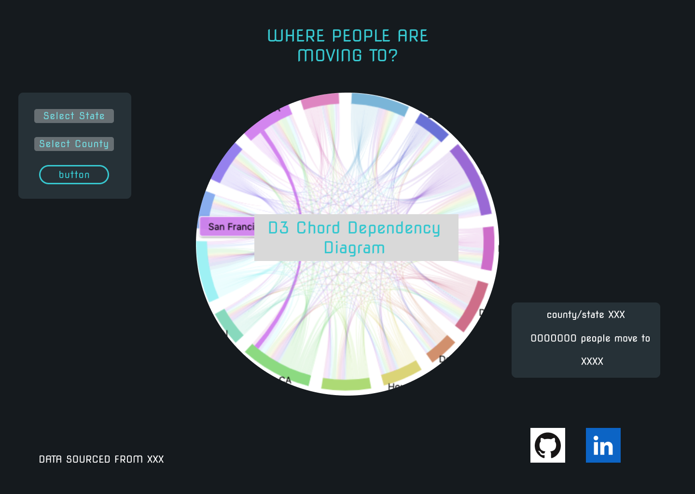

# WHERE WE CAME FROM AND WHERE WE WENT

Live Site: [Where We Came From And Where We Went](https://kevinismcao.github.io/js_migration_flow_data_visualization/)


## Background
3 years after Covid-19 pandemic start, there were many speculation about emptied downtowns and the prospect of remote work. This interactive site aims to visulize the migration pattern in 2018,2019,2020, when the virus started to spread. Click on a specific state will show different county within state and their moving patterns.

## Functionality & MVPs
In the WHERE WE CAME FROM AND WHERE WE WENT?, users will be able to:
* Track each county's resident net move out numbers and which state they are actually moving to? 
* Interact with the county or state user are interested in and lead to datas they search or click for.
* Hover over other state or counties will highlight string/color ribbon that it assocciated with.
* Hover over other state or counties will show datas that it assocciated with.
* Selection tab to select the states and year data user are looking for.

In addition, this project will include:
* A production README

## Wireframes


## Technologies, Libraries, APIs

* Technologies
    * Javascript
    * HTML/CSS
    * Webpack & Babel
    * D3.js
    * npm
    * CENSUS.gov American Community Survey Migration Flows API

This project will be implemented with the following technologies:
* Webpack and Babel to bundle and transpile the source JavaScript code
* npm to manage project dependencies
* d3.js JavaScript library for manipulating documents based on data
* migration data obtained through census.gov

## Fetching Data
Pulling data from Census API and modify data into matrix to be used in creating Chord Dependency Diagram:
```
    export const fetchStateData = async ( ) => {
    // e.preventDefault();
    const stateNum = "*" 
    const countyNum = "*" 
    const names = statesArray
    const censusUrl = `src/scripts/2020migration.json`

    try {
        let res = await fetch(censusUrl, { mode: 'no-cors' }, {
            headers: { 'Accept': 'application/json' }
        });
        if (res.ok) {
            let data = await res.json();
            const matrix = new Array(names.length).fill(0).map(x => Array(names.length).fill(0));
            data.filter(ele => inState(ele))
            data.slice(1).forEach(ele => {
                let currentState = ""
                if (stateNum === "*") {
                    const currentStateArray = ele[0].split(", ");
                    currentState = (currentStateArray[currentStateArray.length - 1]);
                } else {
                    currentState = ele[0]
                }
                let migrateDes = ele[2];
                const currentStateIndex = names.indexOf(currentState);
                const migrateDesIndex = names.indexOf(migrateDes);
                if (currentStateIndex >= 0 && currentStateIndex < names.length && migrateDesIndex >= 0 && migrateDesIndex < names.length && currentStateIndex === migrateDesIndex) {
                    matrix[currentStateIndex][migrateDesIndex] = 0;
                }

                if (currentStateIndex >= 0 && currentStateIndex < names.length && migrateDesIndex >= 0 && migrateDesIndex < names.length && currentStateIndex !== migrateDesIndex) {
                    matrix[currentStateIndex][migrateDesIndex] += parseInt(ele[4]);
                }
                for (let i = 0; i < names.length - 1; i++) {
                    for (let j = i + 1; j < names.length; j++) {
                        let num1 = matrix[i][j];
                        let num2 = matrix[j][i];
                        if (num1 > num2) {
                            matrix[i][j] = (num1 - num2);
                            matrix[j][i] = 0;
                        } else if (num1 < num2) {
                            matrix[i][j] = 0;
                            matrix[j][i] = (num2 - num1);
                        } else {
                            matrix[i][j] = 0;
                            matrix[j][i] = 0
                        }
                    }
                }
            })
            
            return matrix

        } else {
            throw new Error(res);
        }
    } catch (err) {
        console.error(err);
    }
}

```

## Implementation Timeline
* Friday Afternoon and Weekend: Finish setting up project, including getting Webpack up and running. Import and clean/process data from Census API. Create instructions box.
* Monday: Create graph for each states/county migrations and D3.js study.
* Tuesday: Add functionality and user interaction to chord dependency diagram 
* Wednesday: Work on CSS styling, and add in nav links for LinkedIn and Github repo. Make site mobile friendly if there's time. Dark and light model selection.
* Thursday Morning: Finishing up CSS styling. Debug and continue working if have time.

## Bonus Features
* Include a toolip chart for each state or county label
* Include dark and light model 
* Loading page when requesting data from API

## Potential Add-on
* Future data API request when Census updated latest survey
* Potential county to county migration detail data information